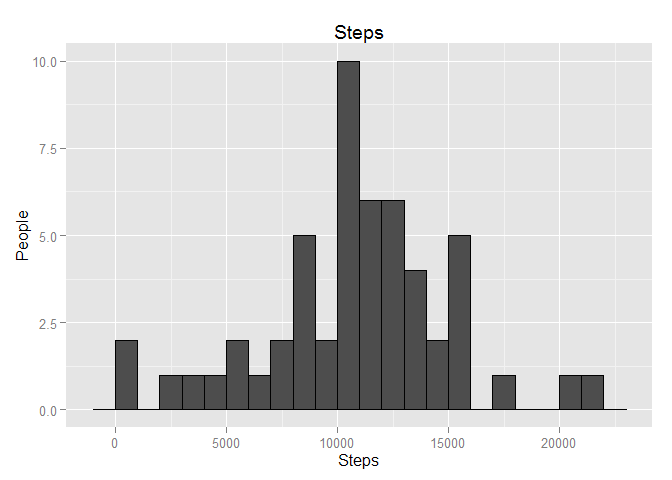
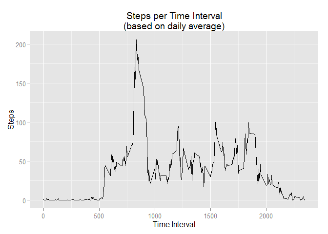
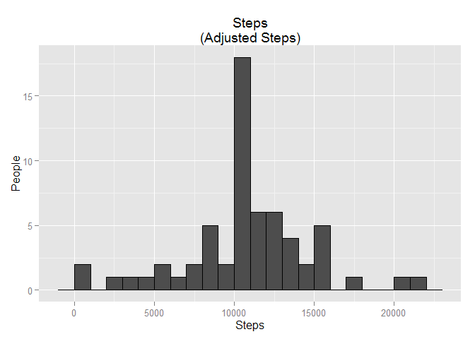
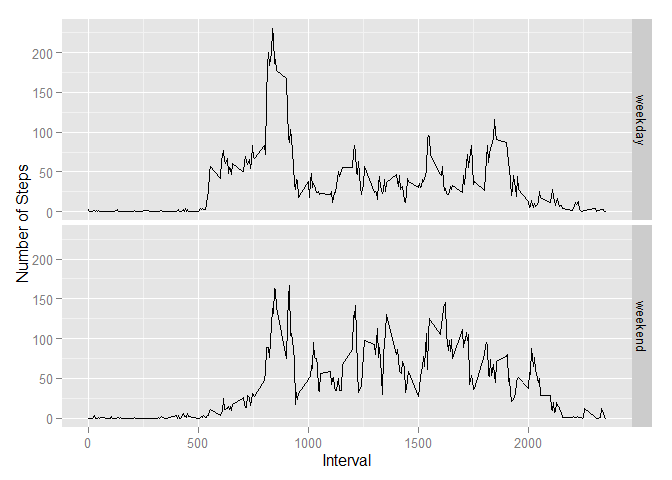

# Reproducible Research: Peer Assessment 1


## Loading and preprocessing the data


```r
unzip("activity.zip")
activity <- read.csv("activity.csv")
activity <- transform(activity, date = as.Date(date))
```


## What is mean total number of steps taken per day?

```r
# Loading Required Libraries
library(plyr)
library(ggplot2)
```

### Calculating the TOTAL steps per date


```r
# NOTE: If you use na.rm = TRUE in the SUM function, you will get 0 even though it 
#       should be NA for some dates. If you subset and remove all NA before summarizing, 
#       we completly remove NAs before even gets calculated.
totalStepsPerDate <- ddply(subset(activity, !is.na(steps)), "date", summarize, total = sum(steps))
```

### Plot historgram based on the previous calculated values


```r
qplot(totalStepsPerDate$total
      , geom     = "histogram"
      , binwidth = 1000
      , main     = "Steps"
      , xlab     = "Steps"
      , ylab     = "People"
      , fill     = I("gray30")
      , col      = I("black")) 
```

 

### Average and Median daily steps

```r
mean(totalStepsPerDate$total)
```

```
## [1] 10766.19
```

```r
median(totalStepsPerDate$total)
```

```
## [1] 10765
```

## What is the average daily activity pattern?

### Calculating the reporting the average daily steps per time interval

```r
meanStepsByInterval <- ddply(subset(activity, !is.na(steps)), "interval", summarize, mean = mean(steps))
ggplot(meanStepsByInterval, aes(x = interval, y = mean, group = 1)) +
    geom_line() +
    xlab("Time Interval") +
    ylab("Steps") +
    ggtitle("Steps per Time Interval\r\n(based on daily average)")
```

 

### Finding the Highest average of Steps

```r
meanStepsByInterval[which.max(meanStepsByInterval$mean), ]
```

```
##     interval     mean
## 104      835 206.1698
```

### Finding the 5-minute interval with the maximun average number of steps

```r
meanStepsByInterval[which.max(meanStepsByInterval$mean), ]
```

```
##     interval     mean
## 104      835 206.1698
```


## Imputing missing values

### Total number of missing values

```r
nrow(activity[is.na(activity$steps), ])
```

```
## [1] 2304
```

### Filling missing values, a simple average value will work for this case.

```r
activity <- merge(activity, meanStepsByInterval, by.x = "interval", by.y = "interval")
activity <- transform(activity, processed_steps = ifelse(is.na(activity$steps), activity$mean, activity$steps))
activity$mean <- NULL
```

### Ploting histogram with the new totals (with the imputaded values)

```r
totalStepsPerDate <- ddply(activity, "date", summarize, total = sum(processed_steps))
qplot(totalStepsPerDate$total
      , geom="histogram"
      , binwidth = 1000
      , main = "Steps\r\n(Adjusted Steps)"
      , xlab = "Steps"
      , ylab = "People"
      , fill = I("gray30")
      , col = I("black")) 
```

 

### Report new Mean and Median, the Mean value is exactly the same as before, because we used Mean values for NA values, the Median has increase a little.

```r
mean(totalStepsPerDate$total)
```

```
## [1] 10766.19
```

```r
median(totalStepsPerDate$total)
```

```
## [1] 10766.19
```


## Are there differences in activity patterns between weekdays and weekends?

```r
# Loading required Date library
library(lubridate)
```

### Calculating Weekend and Weekday dates

```r
activity$wday <- as.factor(ifelse(wday(activity$date) %in% c(1,7), "weekend", "weekday"))
meanStepsPerWeekDayType <- ddply(activity, .(wday, interval), summarize, mean = mean(processed_steps))
```

### Plotting 5-minute graph comparing weekend and weekday readings

```r
ggplot(meanStepsPerWeekDayType, aes(x=interval, y=mean)) + 
    facet_grid(wday~.) + 
    geom_line() + 
    xlab("Interval") + 
    ylab("Number of Steps")
```

 

#### Author: dulfe
#### Date: 2015-10-28
